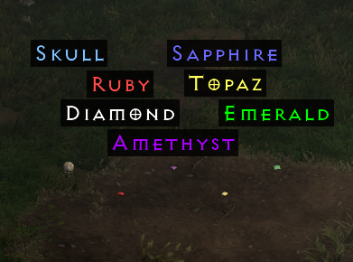

# Loot Filter Changes

## Trash tier affixes

**`Low Quality`, `Damaged`, `Cracked`, and `Crude` item affixes have been modified to blacken the text of the base item, and a grey `(Trash)` label underneath it to quickly identify it as such:**

|  |  |
| :---------------------------------- | :------------------------- |

---
## Item naming & coloration

**Every Elite tier item has been given a `[E]` identifier where the letter is colored yellow, and the brackets are colored white:**

|  |
| :-------------------- |

**Every Exceptional tier item has been given a `[X]` identifier where the letter is colored blue, and the brackets are colored white:**

|  |
| :-------------------------- |

**Ethereal base items have also received a new coloration, items that are ethereal and are lacking sockets will appear with a Light Teal (`#7CDDCC`) coloration on the ground:**

|  |
| :----------------------- |

**I also went ahead and renamed and recolored all the Gas and Oil potions. Oil potions are labeled `<tier> OP` and Gas potions are `<tier> GP` (i.e., `1 OP` is `Fulminating Potion`)**

|  |
| :--------------------- |

**Health and Mana potions received similar treatment and Rejuvenation potions had some adjustments as well:**

|  |  |
| :------------------- | ---------------------- |

**Stamina potions have been renamed to `Milk` in reference to what the *Cow King* drops upon completing his quest. Also.. no more colored antidote and thawing potions:**

|  |  |  |
| :----------------------- | :----------------------- | :---------------------- |
  
**Tomes and Scrolls:**

|  |
| :--------------------------- |

Uber Keys and Essences:

|  |  |
| :----------------------------- | ------------------------ |

**All Amulets & Rings:**

|  |
| :---------------------- |

**Charms (Large Charms get no effect):**

|  |
| :--------------------- |

**Gems got some name and color adjustments, `Flawless` and `Perfect` are also a gold color (like uniques):**

|  |  |  |
| :-------------------------- | :--------------------------- | ------------------------ |
|   |   |                          |

Gold:

|  |
| :------------------- |

---
## Some minor unique item changes

**`Hellfire Torch`, and `Annihilus` have custom drop VFX:**

|  |
| :------------------------ |

---

## Big Rune changes!

#### The crown jewel of the entire loot filter is all the changes I put in for runes! Every high and mid rune now have a VFX (Rune Glyph) that displays their image above them on the ground:

| High Runes                     | Mid Runes                     |
| :----------------------------- | ----------------------------- |
|  |  |

**Runes also have some slightly different naming and Color Theory inspired coloration to make them stand out better. I also retained the Rune Number associated with each rune so you can quickly remember what upgrades into what:**

| High Runes (Red & Green)  | Mid Runes (Gold & Yellow) | Low Runes (Orange & Sky Blue) |
| :------------------------ | ------------------------- | ----------------------------- |
|  |   |       |

In addition to all the name and VFX modifications, I've also added drop-only sound effects to every high and mid rune.

I made it easy to modify these sounds if you're not a fan of them, I did this by adding a unique sound entry for every rune in the game, so if you wanted for some reason to give a *Sol Rune* a sound, you would find the folder where the rune sounds are (`data/hd/global/sfx/item`) and simply place a *.flac* file in there named `drop_sol_hd.flac`

Rune Glyphs are also modular in this way, it would be as simple as dragging and dropping one of rune *.json* files into the appropriate folder (`data/hd/items/misc/rune`), so if you wanted to add a particular effect to *Sol Rune*, you would just drag and drop `sol_rune.json` from one of the *Rune VFX* folders (`godly`, `great`, or `good`) into the previously mentioned folder, and that should be it!

---

## Conclusion

I spent a few weeks working on this filter, and a bit more time than that thinking about what I could add to it to enhance it further. This is what I came up with, I hope you enjoy it.
