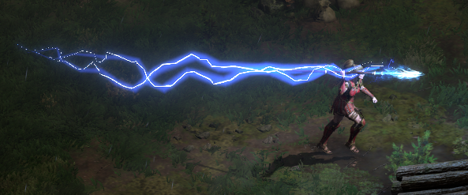

# What's New?

## Loot Filter 2.0

Well, I've created a loot filter more or less from scratch for this release, it features the standard string modifications (i.e., some names changed, some new text colors), and I've also given all mid to high runes *Rune Glyphs* and Beam VFX. I've also added custom *drop only* sound effects for mid and high runes. Read more about it in the [[Loot Filter Guide]].

## Lightning Javelin

**I've moved over the Lightning Javelin effect to exclusively *Titan's Revenge* and *Thunderstroke*:**

|  |
| :-------------------------- |
## I've pruned some things

#### Minimap (from *Bad Luck* modpack)
Mainly because it wouldn't allow people to switch map types, and I got a report of it not working on ultrawide monitors.
#### All the *custom* items (from *Bad Luck* modpack)
I've removed the custom items because I didn't want to deal with trying to make it compatible with the loot filter part of the pack. I also intend to eventually expand the loot filter and I don't want to keep adapting it to include this.
#### Dark Assassin (from *Bad Luck* modpack)
I didn't like the way it modified items to achieve its goal. It also made Shako artificially way darker which looked bizarre.
#### Fire Sword
It has this broken smoke VFX it would leave behind when the VFX for it was initialized, I also didn't like that the base model was changed to that of Kinemil's Awl either.
#### All the *custom* skill effects (from *Bad Luck* modpack)
I removed them because I didn't like that they were adding new custom missiles, some of which broke the game in some places (kill shenk and you'll see what I mean).

I kept the changes to the *Blessed Hammer*'s missile because it was visually pleasing to see the hammer actually *visibly* collide with monsters. I also kept the modification to Hellfire Torch's Firestorm so that it wouldn't *visibly* trigger off the charm, this should hopefully help performance wise if you hit fast (Fury druids I'm looking at you).
#### High Rune drop effect
I removed the old High Rune drop effect in favor of the new one I introduced, it was cool but I felt like it was far too flashy and potentially overwhelming.

---
### Mod Credits

1. Elite Mercenaries - [Bad Luck Modpack](https://www.inven.co.kr/board/diablo2/5842/5159)
2. Faster Buying (at merchants) - [Bad Luck Modpack](https://www.inven.co.kr/board/diablo2/5842/5159)
3. Better Potion Visibility - [sandmaen](https://www.nexusmods.com/diablo2resurrected/mods/72)
4. Dark Loot (darker item display background) - [cale6](https://www.nexusmods.com/diablo2resurrected/mods/497)
5. Custom EXP Bar - [Rocker](https://www.inven.co.kr/board/diablo2/5842/3001)
6. GPS Beacons - [Porory & HeoHeo](https://www.inven.co.kr/board/diablo2/5842/4283)
7. Quick Play - [cale6](https://www.nexusmods.com/diablo2resurrected/mods/492)
8. Skip Videos - [cale6](https://www.nexusmods.com/diablo2resurrected/mods/331)
9. Custom Uber Keys (sprites) - [Gomgu](https://www.inven.co.kr/board/diablo2/5842/185)
10. Remove Lobby Chat - [Penguiin](https://www.nexusmods.com/diablo2resurrected/mods/123)
11. No Mosaic VFX (the effects are now blades) - [HaiTan95](https://www.nexusmods.com/diablo2resurrected/mods/364)
12. Lightning Javelin - [디아히릿](https://www.inven.co.kr/board/diablo2/5842/5685)
13. Area Levels - [cale6](https://www.nexusmods.com/diablo2resurrected/mods/479)
14. Ancient Grimoire - Shadow (Me)
15. Loot Filter 2.0 for *Shadow Pack V2* - Shadow (Me)
